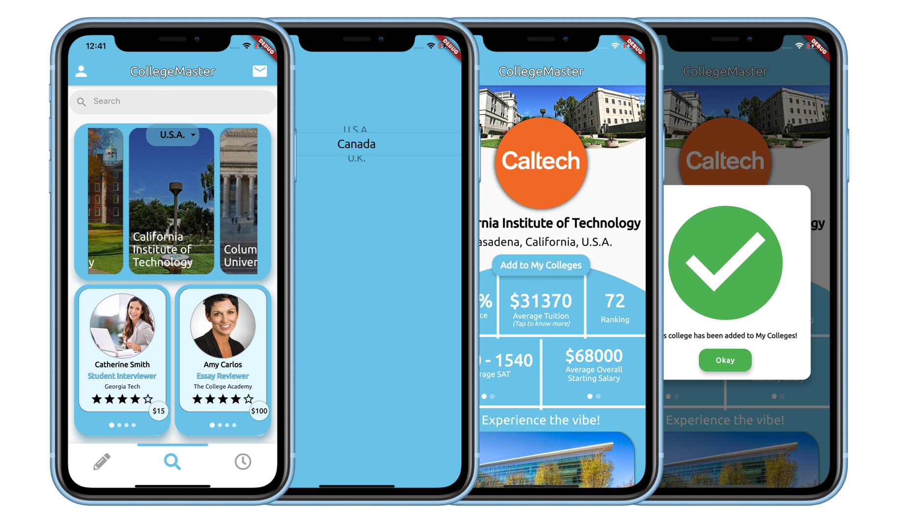
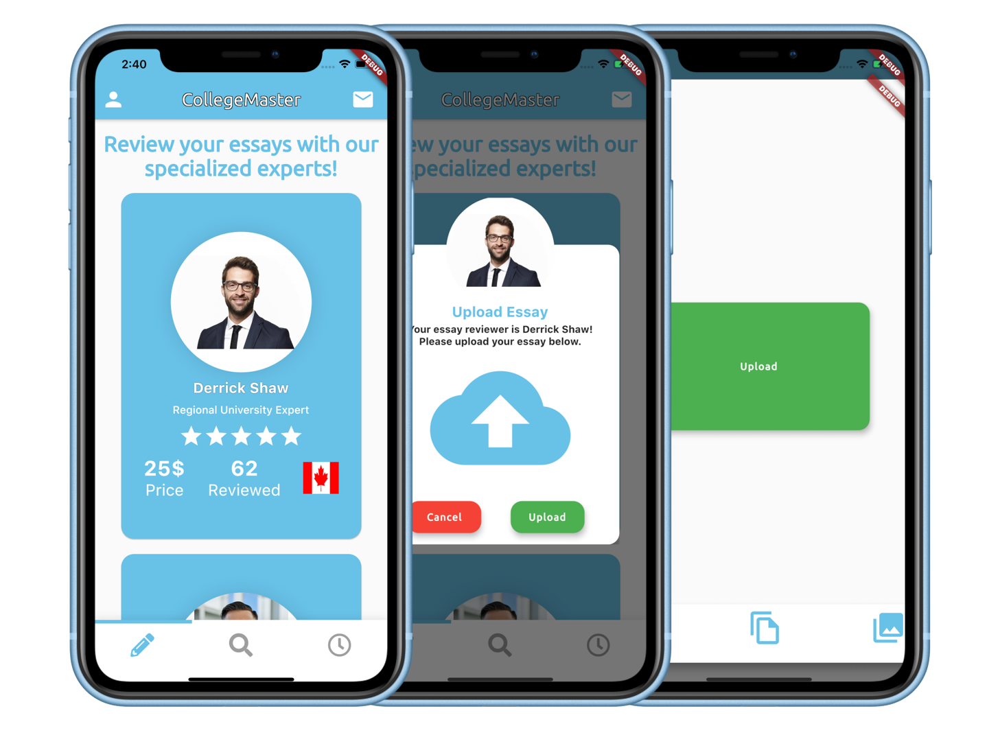
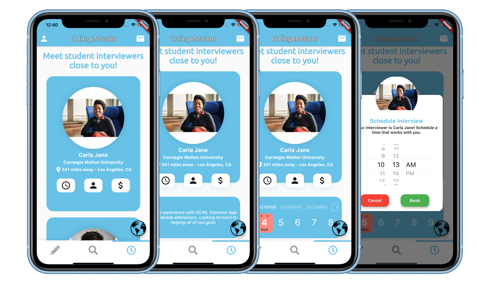
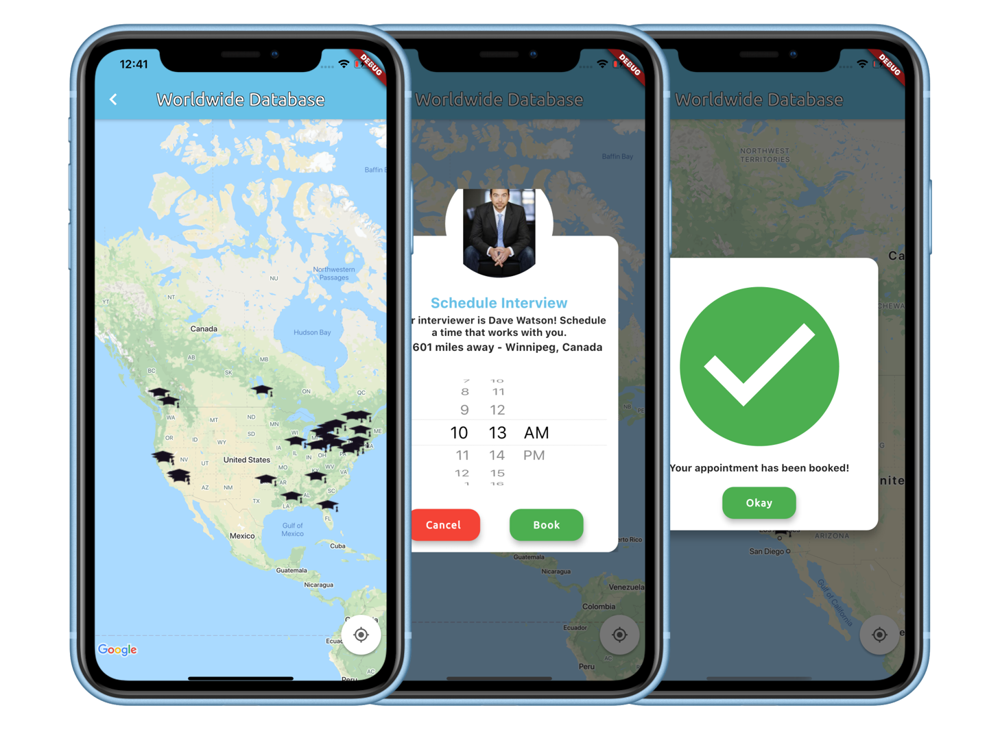
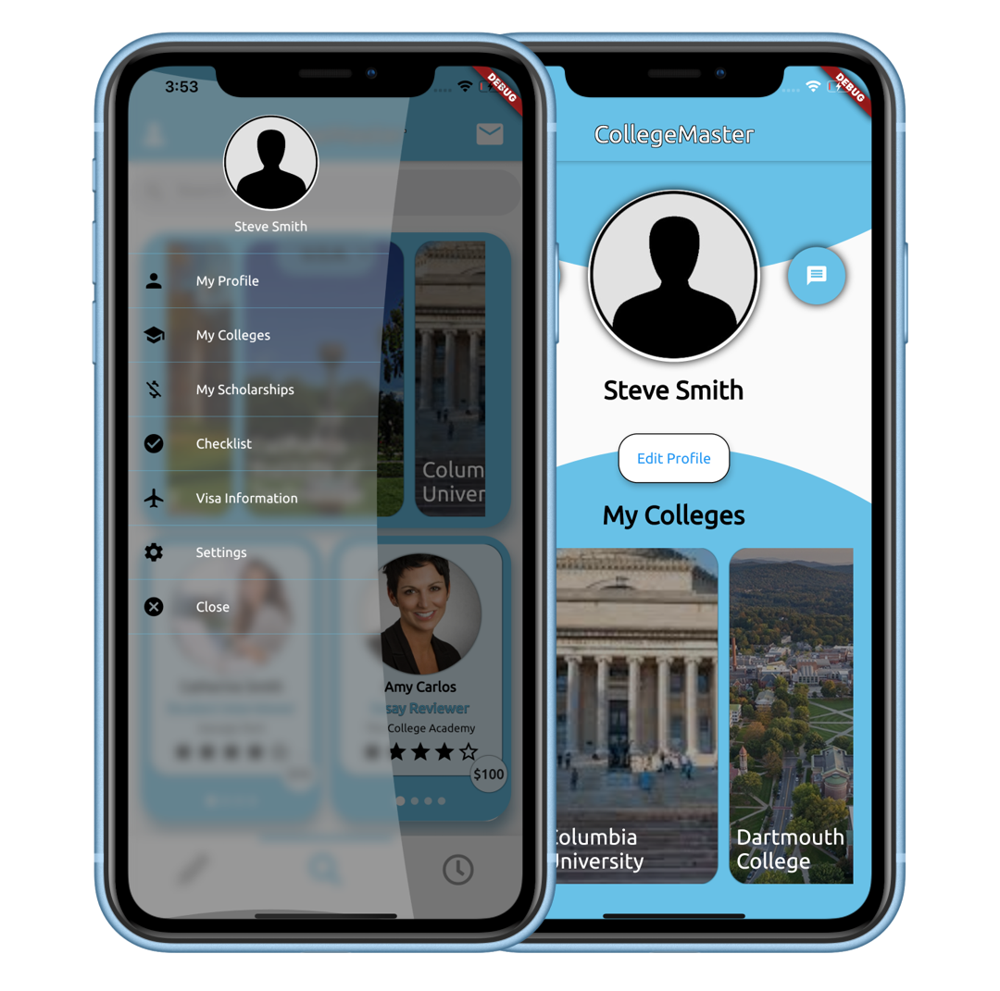
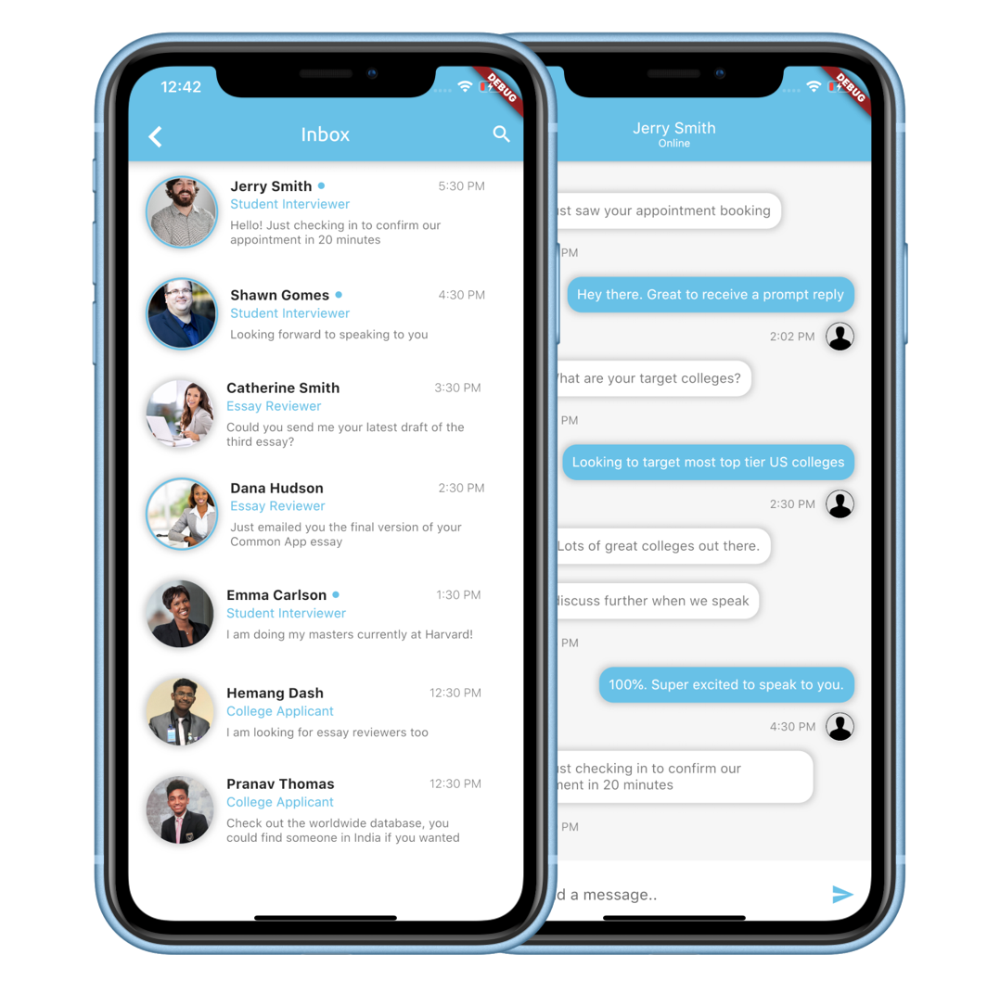

# CollegeMaster

Official Hack for [IvyHacks](https://ivyhacks.com/) by Team CollegeMaster

***

### Table of Contents
* [Inspiration](#inspiration)
* [How it was built](#how-it-was-built)
* [What it does](#what-it-does)
* [Built by](#built-by)

***

### Inspiration
Finding resources and aid to get into your college of top choice can be complicated!  
When we, as international high school students, applied to colleges in the United States, we faced a lot of hurdles through the application process. Finding the correct resources required us to travel. To ask the right questions, we had to pay a huge amount to a college counselor.    
**CollegeMaster** is an app which provides high school students access to a community of essay reviewers, college students and alumni to connect with and ask the right questions, **at their fingertips**. College applicants can access student interviewers nearest to them through our real-time distance calculation algorithm. They can upload their essays to get insights from expert essay reviewers. They can browse through colleges, get information about each college and any college to their list of colleges for later reference in real-time.  
*How have we created this community?* 
We use the robustness of Google Maps to create an interactive worldwide network by representing each student interviewer who signs up with our service with our app's logo as a marker. Users can also message other app users.

***

### How it was built
CollegeMaster is an **iOS / Android** app built with [Flutter](https://flutter.dev/). It uses [Firebase](https://firebase.google.com/) as a realtime backend storage. It also uses the **Google Maps SDK** for [Android](https://developers.google.com/maps/documentation/android-sdk/overview) and for [iOS](https://developers.google.com/maps/documentation/ios-sdk/overview) to display the Worldwide Database of College Students and Alumni.

***

### What it does
Few features have been implemented, while others have been shown for scalability.

#### Implemented Features
- **Discover Page**
    - Search for colleges based on country
        - User can add any college to their **My Colleges** list for later reference
    - Cascading list of **Student Interviewers** and **Essay Reviewers** with their overview and prices

- **Essay Reviewing**
    - Users can choose from *country-specialized expert* Essay Reviewers based on the country chosen during registration
    - Users can upload any type of file for essay reviewing

- **Student Interviewing**
    - Users can choose to connect with alumni and current college students
        - Users can enable **Location Services** to see alumni and college students *nearest to them* (within a 350 miles radius)
    - Book appointments with them for *mock interviews / meetups*

- **Worldwide Database**
    - Via the click of a single button, users can access a worldwide database of college students and alumni - created using the Google Maps API
    - Users can book appointments with them by clicking the markers on our map, represented by graduation hats (our app logo)
    - Book appointments with them for *mock interviews / meetups*

- **College Profile**
    - Shows information about the college and user can add the college to their **My Colleges** list for later reference
- **User Profile**
    - Shows the name of the user and **My Colleges** list

#### Scalable (Displayed) Features
- **Discover Page**
    - Users can use a search bar to lookup **Colleges / Essay Reviewers / College Students and Alumni**
- **Tray**
    - Users can access **Visa Information** about different countries, **Scholarship Information** about different colleges / countries and a **Checklist** showing deadlines for different college applications
- **Messaging**
    - Connect with college students, alumni, essay reviewers and other college applicants

- **College Profile**
    - Shows various data about the college like Acceptance Rate, Average Tuition, Rank, Average SAT Scores and Famous Alumni amongst others

***

### Built by
- [Hemang Dash](https://github.gatech.edu/hdash3)
- [Pranav Thomas](https://github.gatech.edu/pthomas76)